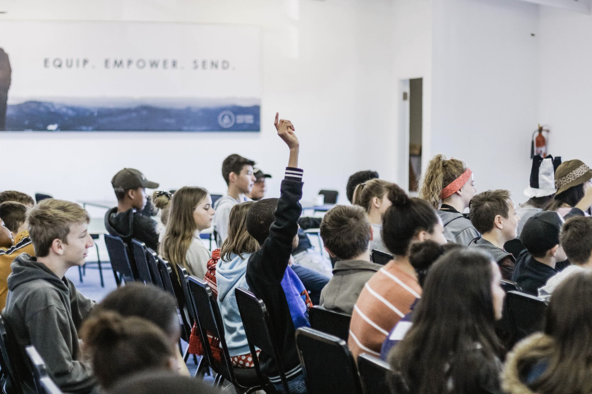

<!DOCTYPE html>
<html>

<head>
    <meta charset="utf-8">
    <meta name="viewport" content="width=device-width, initial-scale=1.0, shrink-to-fit=no">
    <title>MyArticle</title>
    <link rel="stylesheet" href="assets/bootstrap/css/bootstrap.min.css">
    <link rel="stylesheet" href="https://fonts.googleapis.com/css?family=Bitter:400,700">
    <link rel="stylesheet" href="https://fonts.googleapis.com/css?family=Lora">
    <link rel="stylesheet" href="https://fonts.googleapis.com/css?family=Roboto">
    <link rel="stylesheet" href="assets/fonts/font-awesome.min.css">
    <link rel="stylesheet" href="assets/fonts/ionicons.min.css">
    <link rel="stylesheet" href="assets/css/Article-Dual-Column.css">
    <link rel="stylesheet" href="assets/css/Article-List.css">
    <link rel="stylesheet" href="assets/css/Footer-Basic.css">
    <link rel="stylesheet" href="assets/css/Header-Dark.css">
    <link rel="stylesheet" href="assets/css/Highlight-Blue.css">
    <link rel="stylesheet" href="https://cdnjs.cloudflare.com/ajax/libs/animate.css/3.5.2/animate.min.css">
    <link rel="stylesheet" href="https://cdnjs.cloudflare.com/ajax/libs/lightbox2/2.8.2/css/lightbox.min.css">
    <link rel="stylesheet" href="https://cdnjs.cloudflare.com/ajax/libs/Swiper/3.3.1/css/swiper.min.css">
    <link rel="stylesheet" href="assets/css/Lightbox-Gallery.css">
    <link rel="stylesheet" href="assets/css/Navigation-Clean.css">
    <link rel="stylesheet" href="assets/css/Navigation-with-Search.css">
    <link rel="stylesheet" href="assets/css/Simple-Slider.css">
    <link rel="stylesheet" href="assets/css/styles.css">
    <link rel="stylesheet" href="assets/css/Team-Clean.css">
</head>

<body>
    

        <nav class="navbar navbar-light navbar-expand-md" style="background-color: #ffffff;filter: invert(100%);opacity: 0.97;margin-bottom: 30px;">
            
<a class="navbar-brand" href="index.html" style="font-weight: bold;">Glance</a><button data-toggle="collapse" class="navbar-toggler" data-target="#navcol-2">Toggle navigation</button>
                

                    <ul class="nav navbar-nav">
                        <li class="nav-item" role="presentation"><a class="nav-link active" href="ZZHOU.html">MLPR</a></li>
                        <li class="nav-item" role="presentation"><a class="nav-link" href="Canova.html" style="color: #000000;">Canova</a></li>
                        <li class="nav-item" role="presentation"><a class="nav-link" href="#" style="color: #000000;">Youjia</a></li>
                    </ul>
            

    

    </nav>
    <h1 style="padding-top: 214px;padding-right: 0px;margin-top: -1px;padding-left: 91px;color: rgb(255,255,255);font-weight: bold;">VIEWS ON</h1>
    <h1 style="padding-top: 0px;padding-right: 0px;margin-top: -16px;padding-left: 91px;color: rgb(255,255,255);font-weight: bold;">COMPUTATIONAL TECHS.</h1>
    

    

        

            

                <h2 class="text-center" data-bs-parallax-bg="true" style="font-weight: bold;">Our Top Picks for You</h2>
                
Read our latest articles, covering education, and more...

            

            

        

    

    

        

            

                

                    <h3
                        class="name">ML/PR in Education</h3>
                        
The article mainly describes the possible applications of machine learning and pattern recognition in educational establishments while giving counter examples.
<a class="action" href="ZZHOU.html"><i class="fa fa-arrow-circle-right"></i></a>

                

                    <h3 class="name">Article Title</h3>
                    
Aenean tortor est, vulputate quis leo in, vehicula rhoncus lacus. Praesent aliquam in tellus eu gravida. Aliquam varius finibus est, interdum justo suscipit id.
<a class="action" href="#"><i class="fa fa-arrow-circle-right"></i></a>

            

                <h3 class="name">Article Title</h3>
                
Aenean tortor est, vulputate quis leo in, vehicula rhoncus lacus. Praesent aliquam in tellus eu gravida. Aliquam varius finibus est, interdum justo suscipit id.
<a class="action" href="#"><i class="fa fa-arrow-circle-right"></i></a>

    

    

    

    

    

    

        <footer>
            

            <ul class="list-inline">
                <li class="list-inline-item"><a href="index.html">Home</a></li>
                <li class="list-inline-item"></li>
                <li class="list-inline-item"><a href="About.html">About</a></li>
            </ul>
            
Group© 2019

        </footer>
    

    
    
    
    
    
    
</body>

</html>
